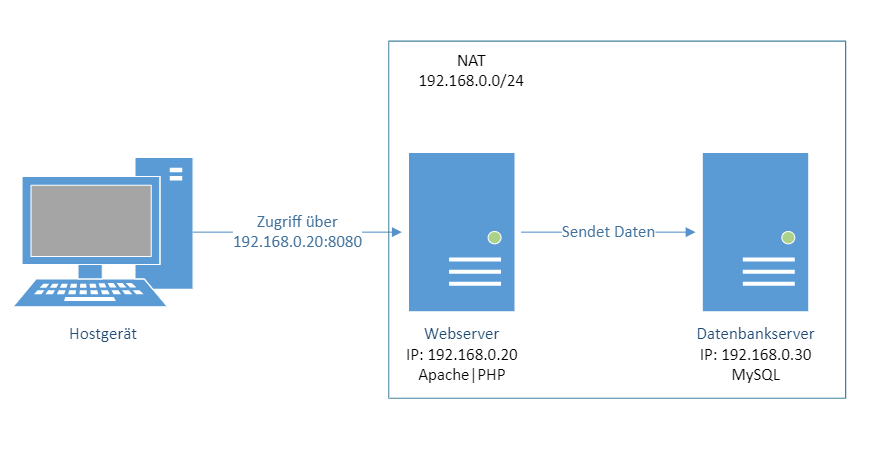

# M300 | Webserver mit Registrierung und MySQL

## Inhaltsverzeichnis

- [Projektbeschreibung](#projektbeschreibung)
    - [Voraussetzungen](#voraussetzungen)
- [Aufbau der Umgebung](#aufbau-der-umgebung)
	- [Identifikationen](#identifikationen)
- [Code](#code)
	- [Vagrantfile](#vagrantfile)
	- [web shell](#web-shell)
	- [db shell](#db-shell)
	- [HTML-File](#html-file)
	- [PHP Prozess](#php-prozess)
- [Vagrantumgebung Starten/Herunterfahren](#vagrantumgebung-starten-/-herunterfahren)
    - [Hochfahren](#hochfahren)
    - [Herunterfahren](#herunterfahren)
    -  [VMs löschen](#vms-löschen)
- [Via SSH auf die VMs zugreifen](#via-ssh-auf-die-vms-zugreifen)
- [Testing Website](#testing-website)
	- [User Registrieren](#user-registrieren) 
- [Testing Datenbank](#testing-datenbank)
    - [Passwort](#Passwort)
    - [1. Via SSH auf Datenbankserver verbinden](#1.-via-ssh-auf-datenbankservre-verbinden)
    - [2. In MySQL einloggen](#2.-in-mysql-einloggen)
    - [3. Datenbank verwenden und Tabelle anzeigen](#3.-datenbank-verwenden-und-tabelle-anzeigen)
    - [Verlassen der VM](#verlassen-der-vm)
- [Sicherheit](#sicherheit)
- [Quellen](#quellen)

---

## Projektbeschreibung
In der LB2 des Moduls 300 (Plattformübergreifende Dienste in ein Netzwerk integrieren) arbeiten wir mit Vagrant. Das Ziel ist anhand von Vagrant ein Dienst mit VMs automatisiert aufsetzen zu können. In userem Fall ist das einen Webserver mit Apache und einen Datenbankserver mit MySQL. Der User füllt auf unserer Website ein Formular mit Vorname und Nachname aus. Diese Informationen werden dann in der MySQL-Datenbank gespeichert. Die Dokumentation der LB2 wird in Markdown geschrieben.

### Voraussetzungen
- Die neuste Version von Virtualbox muss installiert sein
- Auf Virtualbox dürfen keine VMs vorhanden sein, die "m300_webserver" oder "m300_database" heissen
- Vagrant muss installiert sein

---

## Aufbau der Umgebung

Die Umgebung besteht aus einem Webserver und einem Datenbankserver. Auf dem Webserver ist Apache und PHP installiert und auf der Datenbank MySQL.



### Identifikationen
- **Webserver**
    - Ubuntu/bionic64
    - 1024 MB RAM
    - Name: m300_webserver
    - Apache2-Dienst
    - PHP
    - IP-Adresse: 192.168.0.20
    - Port: 80
    - Portforwarding: 8080


- **Datenbankserver:**
    - Ubuntu/bionic64
    - 2048 RAM
    - Name: m300_database
    - MySQL-Dienst
    - IP-Adresse: 192.168.0.30
    - Port: 80
    - Portforwarding: 3306


---

## Code

### Vagrantfile
```
ADDITIONALFILES = Dir.pwd + "/AdditionalFiles"
```
Als erstes geben wir den Pfad an, an dem die Files sind, welche wir für die VMs brauchen.
```
Vagrant.configure("2") do |config|
```
Ab hier startet die Konfiguration der VMs.
```
  config.vm.synced_folder ADDITIONALFILES, "/var/www"
```
Hier teilen wir den Ordner für die VMs.
```
  config.vm.box = "ubuntu/bionic64"
```
Nun geben wir noch die Box der VMs an, damit Vagrant dies installieren kann.
```
# Webserver Konfiguration
  config.vm.define "web" do |web|
    web.vm.provider :virtualbox do |vb|
     vb.name = "m300_webserver"
     vb.memory = 1024
    end
```
Bei diesem Schritt Konfigurieren wir den Webserver.
```
# Netzwerk-Konfiguration für den Webserver
  web.vm.network "private_network", ip: "192.168.0.20"
#   virtualbox_intnet: true
  web.vm.network "forwarded_port", guest: 80, host: 8080
  
# File zum Apache installieren
  web.vm.provision "shell", path: "web_shell.sh"


  end
```
Hier wird noch die Netzwerkkonfiguration angegeben.
```
# Datenbankserver Konfiguration
  config.vm.define "db" do |db|
    db.vm.provider :virtualbox do |vb|
      vb.name = "m300_database"
     vb.memory = 2048
  end
```
Wie beim Webserver konfigurieren wir hier den Datenbankserver.
```

# Netzwerk-Konfiguration für den Datenbankserver
  db.vm.network "private_network", ip: "192.168.0.30"
#   virtualbox_intnet: true
  db.vm.network "forwarded_port", guest: 80, host: 3306

# File mit der Datenbank-Installation
 db.vm.provision "shell", path: "db_shell.sh"
 

  end


end
```
Zum Schluss konfigurieren wir noch das Netzwerk des Datenbankservers.

### web shell
Dieser Code zeigt die Installation der Dienste auf dem Webserver. Dies muss gemacht werden, damit wir überhaupt eine Website erstellen können.
```
# Pakete herunterladen
apt-get update

# Apache installieren
apt install -y apache2

# PHP installieren
sudo apt-get install -y php-fpm php-mysql
sudo apt-get install -y php libapache2-mod-php php-mysql

# Dienst neu Starten
sudo service apache2 restart
```
### db shell
Folgende Konfigurationen müssen gemacht werden, damit MySQL installiert und die Datenbank erstellt wird.
```
# Pakete herunterladen
sudo apt-get update
# mysql Benutzername: root
# mysql Passwort: rootpass
sudo debconf-set-selections <<< 'mysql-server mysql-server/root_password password rootpass'
sudo debconf-set-selections <<< 'mysql-server mysql-server/root_password_again password rootpass'
```
```
# mysql installieren
sudo apt-get install -y mysql-server
```
In diesem Schritt wird MySQL installiert.
```

sudo sed -i -e"s/bind-address\s*=\s*127.0.0.1/bind-address = 0.0.0.0/" /etc/mysql/mysql.conf.d/mysqld.cnf

# Root-Zugriff von jedem Host
echo "GRANT ALL PRIVILEGES ON *.* TO 'root'@'%' IDENTIFIED BY 'rootpass' WITH GRANT OPTION; FLUSH PRIVILEGES;" | mysql -u root --password=rootpass

#Service neu starten
sudo service mysql restart

# Datenbank für die Registrieungen erstellen
mysql -uroot -prootpass -e "DROP DATABASE IF EXISTS formresponses; 
	CREATE DATABASE formresponses; 
	USE formresponses; 
	CREATE TABLE response (id INT NOT NULL PRIMARY KEY AUTO_INCREMENT, 
		firstname VARCHAR(20), lastname VARCHAR(20));"
sudo service mysql restart
```
In diesen Schritten wird eine neue Tabelle erstellt. In diese Tabelle werden die Daten der Registrierung gespeichert.

### HTML-File
Folgendes HTML-File haben wir für unsere Website haben erstellt. Hier werden die Daten in die Variabeln gespeichert.
```
<!DOCTYPE html>
<html lang="en-US">
<head>
<meta charset="UTF-8">
<link rel="stylesheet" type="text/css" href="css.css">
<meta name="viewport" content="width=device-width, initial-scale=1.0">
<title>M300 - Registration</title>
</head>
<body>
<div class="form">
    <form method="POST" action="process.php">
        <h1>M300 - Registration</h1>
        <p>This form will send the following data to the database server.</p>
        <table>
            <tr>
                <td>
                    <label for="firstname">First Name:</label><br>
                    <input type="text" name="firstname" id="">
                </td>
            </tr>
            <tr>
                <td>
                    <label for="lastname">Last Name:</label><br>
                    <input type="text" name="lastname" id="">
                </td>
            </tr>
            <td>
                <input type="submit" name="submit" value="Sign Up!">
            </td>
        </table>
    </form>
</div>
</body>
</html>
```
### PHP Prozess
Folgende Verbindungen müssen im PHP-File vorhanden sein. Diese Daten werden an den MySQL-Server gesendet.
```
<!doctype html>
<html>
<head>
<title>Database output</title>
</head>
<body>
    <table>
		<tr>
			<th>First Name</th>
			<th>Last Name</th>
		</tr>
            <?php
            // Schauen, ob etwas in der Datenbank ist
            if(isset($_POST['submit']))
            {
                $firstname = $_POST['firstname'];
                $lastname = $_POST['lastname'];
		
                $con = mysqli_connect('192.168.0.30', 'root', 'rootpass','formresponses');
            // Verindung zur Datenbank überprüfen
                if (!$con)
                {
                    die("Connection failed!" . mysqli_connect_error());
                }
            // Daten in die Tabelle legen
                $sql = "INSERT INTO response (firstname, lastname) VALUES ('$firstname', '$lastname')";


                $rs = mysqli_query($con, $sql);
            // Gibt einen Output, wenn etwas in der Datenbank ist          
                if($rs)
                {
			$selectsql = "SELECT firstname, lastname from response";
			$resultat = $con-> query($selectsql);

			if ($resultat-> num_rows > 0) {
				while ($row = $resultat-> fetch_assoc()) {
					echo "</td><td>". $row["firstname"] ."</td><td>". $row["lastname"] ."</td><td>";
			}
				echo "</table>";
			}
                }
                else
                {
                    echo "The Data couldn't be loaded in the database.";
                }
            }
        ?>
    </table>
</body>
</html>
```

---

## Vagrantumgebung Starten/Herunterfahren

### Hochfahren
Um die Umgebung zu starten öffnet man als erstes **im Ordner vom Vagrantfile** ein git Bash Terminal. In dieses kann man dann `vagrant up` schreiben. Danach werden die VMs aufgesetzt.

### Herunterfahren
Um die Umgebung herunterzufahren kann man ins gleiche Terminal `vagrant halt`  schreiben.

### VMs löschen
Um die VMs zu löschen kann man ins Terminal `vagrant destroy`" schreiben. Danach bestätigt man mit `y`, dass man die VMs löschen möchte.

>**NOTE:** Das Terminal muss immer **im Ordner vom Vagrantfile** geöffnet sein!
 
 ---
 
## Via SSH auf die VMs zugreifen

Um auf die einzelnen VMs zuzugreifen, muss man lediglich im Terminal im **gleichen Ordner wie das Vagrantfile** sein und den Befehl **vagrant ssh "Maschine"** eingeben.

|Welche Maschine  |Command (im Terminal)              |
|-----------------|-----------------------------------|
|Webserver    |`vagrant ssh web`       |
|Datenbankserver  |`vagrant ssh db`        |

---

## Testing Website
### User Registrieren
- Im Webbrowser die IP mit dem Port `192.168.0.20:80` eintragen
- Name nach Wahl eintragen

## Testing Datenbank
### Passwort

- Benutzername: root
- Passwort: rootpass

### 1. Via SSH auf Datenbankserver verbinden
- Terminal im Ordner vom Vagrantfile öffnen
- Ins Terminal `vagrant shh db` tippen

### 2. In MySQL einloggen
- Mit `mysql -uroot -p` in MySQL einloggen
- In die Passwortabfrage `rootpass` eintppen

### 3. Datenbank verwenden und Tabelle anzeigen
- Mit `use formresponses;` Datenbank verwenden
- Tabelle anzeigen mit `select*from response;`

### Verlassen der VM
- Um die VM zu verlassen und die SHH-Verbindung zu trennen, muss man den Befehl `exit` eintippen
---

## Sicherheit
- Der Datenbankserver bzw. MySQL ist mit einem Passwort geschützt
- Der ist mit dem ungeschützten Protokoll "HTTP" erreichbar

---
### Quellen
[MySQL Installation](https://linuxize.com/post/how-to-install-mysql-on-ubuntu-18-04/)

[Webserver mit MySQL](https://medium.com/analytics-vidhya/web-development-basics-how-to-connect-html-form-to-mysql-using-php-on-apache-web-server-part-1-7edce564169e)

[Website Formular](https://www.youtube.com/watch?v=gpM9hUKXLgk&ab_channel=ProgrammingKnowledge)

[PHP Syntax](https://www.w3schools.com/php/php_syntax.asp)
