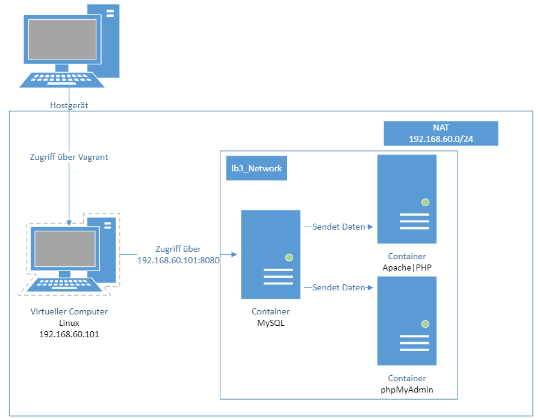

# M300 | Webserver mit MySQL und phpMyAdmin

## Inhaltsverzeichnis

- [Projektbeschreibung](#projektbeschreibung)
    - [Voraussetzungen](#voraussetzungen)
- [Aufbau der Umgebung](#aufbau-der-umgebung)
	- [Identifikationen](#identifikationen)
- [Code](#code)
	- [Docker-Compose](#docker-compose)
	- [Dockerfile php](#dockerfile-php)
	- [php Index File](#php-index-file)
	- [Dockerfile für MySQL](#Dockerfile-für-mysql)
	- [SQL-Code](#sql-code)
- [Dockerumgebung Starten/Herunterfahren](#dockerumgebung-starten-/-herunterfahren)
    - [Hochfahren](#hochfahren)
    - [Container stoppen](#container_stoppen)
    -  [Conatiner löschen](#container-löschen)
- [Testing Website](#testing-website)
	- [Userdaten ansehen](#userdaten_ansehen) 
- [Testing phpMyAdmin](#testing-phpmyadmin)
    - [Passwort](#Passwort)
    - [phpMyAdmin](#phpMyAdmin)
- [Sicherheit](#sicherheit)
- [Quellen](#quellen)

---

## Projektbeschreibung
In der LB3 des Moduls 300 (Plattformübergreifende Dienste in ein Netzwerk integrieren) arbeiten wir mit Containern. Das Ziel ist anhand von Docker ein Dienst mit Containern automatisiert aufsetzen zu können. In userem Fall ist das einen Webserver mit Apache und einen Datenbankserver mit MySQL. Zu MySQL haben wir auch noch phpMyAdmin. Mit dem Befehl docker-compose werden Daten automatisiert in eine MySQL Datenbank geschrieben. Zu den Daten gehört der Username und das Passwort. Diese Einträge sind dann auf dem Webserver ersichtlich. Die Dokumentation der LB3 wird in Markdown geschrieben.

### Voraussetzungen
- Auf der VM muss Docker-Compose installiert sein
- Das Git Repository muss lokal auf der VM sein
- Vagrant muss installiert sein (Für die VM)

---

## Aufbau der Umgebung

Die Umgebung besteht aus drei Containern. Auf ersten ist Apache und PHP installiert, auf dem zweiten MySQL und auf dem letzten noch PhpMyAdmin



### Identifikationen
- **Webserver**
    - php-Apache
    - Name: lb3_php-apache
    - Apache2-Dienst
    - PHP
    - Port: 80
    - Portforwarding: 8080


- **Datenbankserver:**
    - MySQL
    - Name: lb3_mysql
    - MySQL-Dienst
    - Port: 3306
    - Portforwarding: 9906 


- **phpMyAdmin:**
    - phpMyAdmin
    - Name: lb3_mysql
    - Port: 80
    - Portforwarding: 8000 

---

## Code

### Docker-Compose
```
version: '2'
```
Als erstes definieren wir die Version von Docker-Compose.
```
networks:
    lb3_Network:
```
Als nächstes wir das Netzwerk für die Container definiert. In userem Fall lb3_Network.
```
services:
```
Ab hier werden die verschiedenen Containern erstellt.
```
php-apache-environment:
        container_name: lb3_php-apache
        build:
            context: ./php
            dockerfile: Dockerfile
        depends_on:
            - db
        volumes:
            - ./php/src:/var/www/html/
        ports:
            - "8080:80"
        networks:
            - lb3_Network
```
Nun erstellen wir den ersten Containern mit den folgenden Eigenschaften. Hier ist es der Webserver-Container.
```
db:
        container_name: lb3_db
        image: mysql
        restart: always
        environment:
            MYSQL_ROOT_PASSWORD: MYSQL_ROOT_PASSWORD
            MYSQL_DATABASE: MYSQL_DATABASE
            MYSQL_USER: MYSQL_USER
            MYSQL_PASSWORD: MYSQL_PASSWORD
        build:
            context: ./mysql
            dockerfile: Dockerfile
        volumes:
            - ./mysql/init.sql:/docker-entrypoint-initdb.d/init.sql
        ports:
            - "9906:3306"
        networks:
            - lb3_Network
```
Als nächstes die Datenbank.
```
phpmyadmin:
        image: phpmyadmin/phpmyadmin
        
        restart: always
        environment:
              PMA_HOST: db
        depends_on:
            - db
        ports:
            - "8000:80"
        networks:
            - lb3_Network
```
Und zuletzt noch phpMyAdmin.

### Dockerfile php
Dieser Code zeigt das Image basiert auf php.
```
FROM php:8.0-apache
RUN docker-php-ext-install mysqli && docker-php-ext-enable mysqli
RUN apt-get update && apt-get upgrade -y
```
### php Index File
Mit dem folgenden Code werden die Daten von der Datenbank auf den Webserver geschrieben.
```
<?php
// Der MySQL Servicename, welcher im docker-compose.yml definiert ist.
$host = 'db';

// Datenbank Username
$user = 'MYSQL_USER';

// Datenbank User Passwort
$pass = 'MYSQL_PASSWORD';

// Datenbankname
$mydatabase = 'MYSQL_DATABASE';

// Verbindung zur Datenbank herstellen
$conn = new mysqli($host, $user, $pass, $mydatabase);

// Anfrage
$sql = 'SELECT * FROM users';

if ($result = $conn->query($sql)) {
    while ($data = $result->fetch_object()) {
        $users[] = $data;
    }
}

foreach ($users as $user) {
    echo "<br>";
    echo $user->username . " " . $user->password;
    echo "<br>";
}
?>
```

### Dockerfile für MySQL
Dieser Code verweist auf ein Datenbankscript, welches eine Tabelle erstellt und Daten einträgt.
```
FROM mysql:8.0

COPY ./mysql/init.sql /docker-entrypoint-init.d/init.sql
```
### SQL-Code
Folgender SQL-Code erstellt eine Tabelle und trägt Daten ein.
```
Use MYSQL_DATABASE;
drop table if exists `users`;
create table `users` (
    id int not null auto_increment,
    username text not null,
    password text not null,
    primary key (id)
);
insert into `users` (username, password) values
    ("Administrator","password"),
    ("Testuser","this is my password"),
    ("Job","12345678");>
```

---

## Dockerumgebung Starten/Herunterfahren

### Hochfahren
Um die Umgebung zu starten muss man **im Ordner vom docker-compose.yml** den Befehl `docker-compose up -d` eintragen.

### Container stoppen
Um die Umgebung herunterzufahren kann man ins Terminal `docker stop "Container-ID"`  schreiben.

### Container löschen
Um die Container zu löschen kann man ins Terminal `docker rm "Container-ID"`" schreiben.

---

## Testing Website
### Userdaten ansehen
- Im Webbrowser die IP mit dem Port `192.168.60.101:8080` eintragen
- Die Daten der Datenbank werden angezeigt

## Testing phpMyAdmin
### Passwort

- Benutzername: root
- Passwort: MYSQL_ROOT_PASSWORD

### phpMyAdmin

- Im Webbrowser die IP mit dem Port `192.168.60.101:8000` eintragen
- Mit dem Benutzername und Passwort einloggen
- Datenbank MYSQL_DATABASE auswählen
- Datensätze ansehen

---

## Sicherheit
- Der Datenbankserver bzw. MySQL ist mit einem Passwort geschützt
- Der ist mit dem ungeschützten Protokoll "HTTP" erreichbar

---
### Quellen
[Docker Netzwerk](https://docs.docker.com/compose/networking/)

[SQL-Code](https://stackoverflow.com/questions/64428866/create-database-and-table-automatically-with-docker-compose)

[PHP Syntax](https://www.w3schools.com/php/php_syntax.asp)
